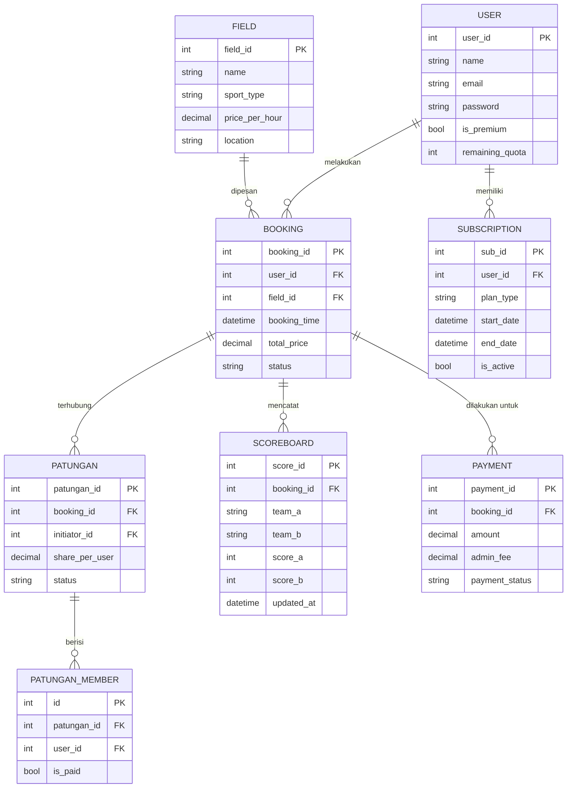
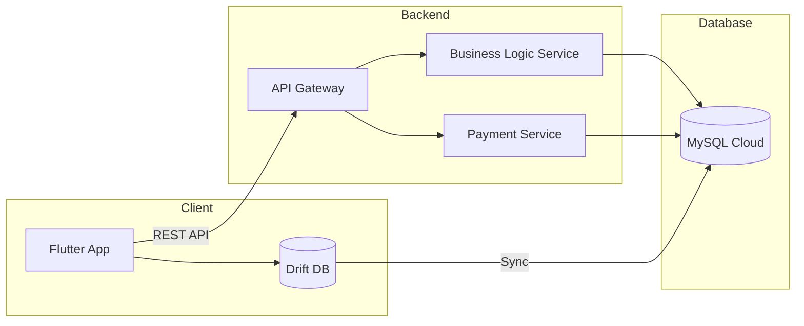

# **Software Requirements Specification (SRS)**  
## **Aplikasi Gsports v1.0**

---

### **1. Informasi Umum**
- **Nama Aplikasi:** Gsports  
- **Versi Dokumen:** 1.0  
- **Tanggal:** 5 November 2025  
- **Anggota Tim:**
  - Ahmad Rois (221240001239)
  - M. Gilang M.W. Sabdokafi (221240001248)

---

### **2. Pendahuluan**

#### **2.1 Tujuan**
Dokumen ini menjelaskan kebutuhan perangkat lunak untuk aplikasi **Gsports**, yaitu platform pemesanan lapangan olahraga dengan fitur tambahan seperti patungan biaya, penghitung skor digital, dan sistem premium berbasis langganan. SRS ini menjadi acuan dalam pengembangan sistem agar konsisten, efisien, dan terintegrasi.

#### **2.2 Ruang Lingkup**
Aplikasi **Gsports** dirancang untuk memudahkan pengguna dalam mencari, melihat ketersediaan, dan memesan lapangan olahraga secara daring. Pengguna dapat:
- Melihat ketersediaan lapangan tanpa login.
- Melakukan pemesanan setelah login.
- Bergabung dalam sistem patungan (split payment).
- Menggunakan penghitung skor digital yang bisa menyimpan hasil pertandingan.
- Menggunakan sistem kuota dan langganan premium.

#### **2.3 Definisi**
- **Pengguna:** Individu yang menggunakan aplikasi Gsports.
- **Admin:** Pengelola sistem dan penyedia lapangan.
- **Lapangan:** Tempat olahraga yang dapat dipesan.
- **Patungan:** Mekanisme pembagian biaya antara beberapa pengguna.
- **Premium:** Sistem langganan untuk fitur eksklusif.

---

### **3. Deskripsi Umum**

#### **3.1 Perspektif Produk**
Aplikasi **Gsports** merupakan sistem terdistribusi dengan arsitektur client-server yang memanfaatkan database lokal (Drift) dan cloud (MySQL). Komunikasi antara aplikasi dan server menggunakan REST API.

```mermaid
graph TD
    subgraph Client
        A1[Flutter App]
        A2[Local DB (Drift)]
    end

    subgraph Backend
        B1[API Gateway]
        B2[Business Logic Service]
        B3[Payment Service]
    end

    subgraph Database
        C1[(MySQL Cloud)]
        C2[(Drift Local)]
    end

    A1 --> A2
    A1 -->|REST API| B1
    B1 --> B2
    B1 --> B3
    B2 --> C1
    C1 -->|Sync Data| C2
```

#### **3.2 Fungsi Sistem**
- Menampilkan daftar dan ketersediaan lapangan olahraga.
- Melakukan pemesanan lapangan (individu dan patungan).
- Mengelola jadwal pemesanan.
- Menghitung dan menyimpan skor pertandingan.
- Mengatur sistem kuota dan langganan premium.
- Mengatur pembayaran dan tarif admin.

#### **3.3 Karakteristik Pengguna**
- **Pengguna umum:** Pemain olahraga individu atau kelompok.
- **Admin lapangan:** Pemilik fasilitas olahraga.
- **Super Admin:** Pengelola utama sistem.

#### **3.4 Kendala**
- Aplikasi harus bekerja **offline** terbatas dengan database lokal Drift.
- Sinkronisasi otomatis saat koneksi tersedia.
- Transaksi dan skor harus konsisten antara lokal dan cloud.

#### **3.5 Asumsi dan Ketergantungan**
- Koneksi internet tersedia untuk sinkronisasi data.
- Gateway pembayaran (Midtrans/Xendit) mendukung split payment.
- Integrasi Flutter, MySQL, dan Drift berjalan kompatibel.

---

### **4. Kebutuhan Fungsional**

#### **4.1 Manajemen Pengguna**
- Pengguna dapat melakukan registrasi dan login.
- Pengguna dapat melihat lapangan tanpa login.
- Login wajib saat pemesanan atau pencatatan skor.

#### **4.2 Manajemen Lapangan**
- Admin dapat menambah, mengedit, dan menghapus data lapangan.
- Sistem menampilkan ketersediaan lapangan berdasarkan jadwal.

#### **4.3 Pemesanan Lapangan**
- Pengguna dapat melakukan pemesanan individu atau patungan.
- Sistem menghitung dan membagi tarif secara otomatis.
- Admin fee diterapkan untuk setiap transaksi.

#### **4.4 Fitur Patungan**
- Pengguna dapat membuat grup patungan dan mengundang pengguna lain.
- Pembayaran dibagi rata antar anggota.
- Status “penuh” jika semua anggota telah membayar bagian mereka.

#### **4.5 Papan Skor Digital**
- Pengguna dapat mencatat skor pertandingan.
- Data skor dapat disimpan di cloud untuk pengguna terautentikasi.
- Skor dapat dilihat di riwayat pertandingan.

#### **4.6 Sistem Premium**
- Pengguna baru memiliki 5 kuota penggunaan dan 5 cabang olahraga terbatas.
- Kuota berkurang setiap kali pemesanan dilakukan.
- Pengguna dapat berlangganan untuk akses tanpa batas.

#### **4.7 Sinkronisasi Drift - Cloud**
- Data disimpan sementara di Drift.
- Sistem otomatis menyinkronkan ke MySQL Cloud.
- Konflik data diselesaikan menggunakan timestamp terbaru.

---

### **5. Kebutuhan Non-Fungsional**

| Kategori | Kebutuhan |
|-----------|------------|
| **Keamanan** | Autentikasi JWT, enkripsi data lokal |
| **Kinerja** | Respons API < 1 detik, sinkronisasi otomatis |
| **Reliabilitas** | Drift berfungsi offline, auto-reconnect |
| **Usabilitas** | UI responsif berbasis Flutter |
| **Kompatibilitas** | Flutter 3.x, MySQL 8, Dart 3, REST API JSON |
| **Maintainability** | Arsitektur modular, dokumentasi OpenAPI |

---

### **6. Rancangan Basis Data (ERD)**



---

### **7. Arsitektur Sistem**

#### **7.1 Komponen Utama**
1. **Flutter App (Client)**
   - UI interaktif dan manajemen data lokal.
2. **Drift Local DB**
   - Menyimpan data sementara dan kuota pengguna.
3. **API Gateway**
   - Menangani autentikasi dan routing ke service backend.
4. **Business Logic Service**
   - Mengelola pemesanan, patungan, dan sinkronisasi.
5. **Payment Service**
   - Mengatur transaksi dan admin fee.
6. **MySQL Cloud**
   - Menjadi pusat data utama sistem.

#### **7.2 Diagram Arsitektur**


---

### **8. Rencana Pengujian**

| Jenis Uji | Deskripsi | Status |
|------------|------------|--------|
| Unit Test | Pengujian fungsi login, booking, dan sinkronisasi | Direncanakan |
| Integration Test | Integrasi Flutter ↔ API ↔ MySQL | Direncanakan |
| UAT | Pengujian oleh pengguna aktif | Direncanakan |
| Load Test | Pengujian performa 100 user aktif | Direncanakan |

---

### **9. Kesimpulan**
Dokumen ini menjadi pedoman teknis dan fungsional dalam pengembangan aplikasi **Gsports**. Dengan sistem yang fleksibel, modular, dan sinkronisasi Drift–Cloud, Gsports diharapkan mampu menyediakan pengalaman digital yang efisien dan inovatif untuk ekosistem olahraga modern.

---
